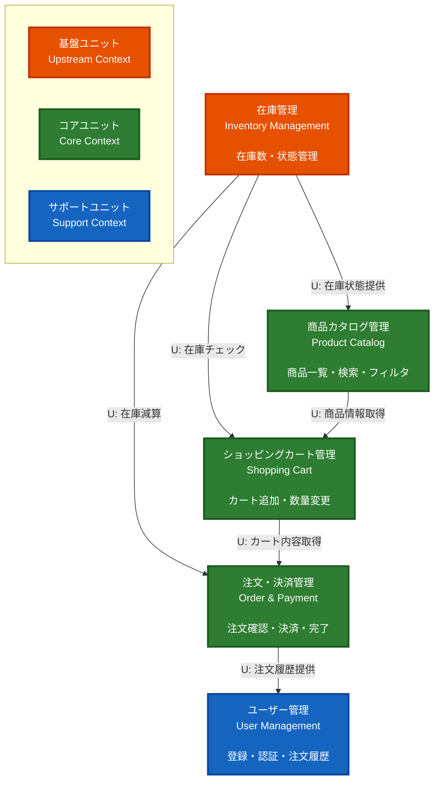

# コンテキストマップ (Context Map)

## 概要
本ECサイトシステムの各Unit of Work（境界づけられたコンテキスト）間の関係性を表すコンテキストマップです。

## コンテキストマップ図



## ユニットの分類

### 🟠 基盤ユニット (Upstream Context)
システムの基礎となる、他ユニットから参照される独立性の高いコンテキスト

- **在庫管理 (Inventory Management)**
  - 他の全ての主要ユニットから参照される基盤
  - 商品カタログ、カート、注文の各ユニットに在庫情報を提供
  - 依存するユニット: なし

### 🟢 コアユニット (Core Context)
ビジネスの中核を担う、主要な購入フローを構成するコンテキスト

- **商品カタログ管理 (Product Catalog)**
  - 商品閲覧・検索の入口
  - US-001〜US-004を提供

- **ショッピングカート管理 (Shopping Cart)**
  - 購入プロセスの中核
  - US-005〜US-008を提供

- **注文・決済管理 (Order & Payment)**
  - 購入の完了処理
  - US-009〜US-011を提供

### 🔵 サポートユニット (Support Context)
コアビジネスを支援する付加的な機能を提供するコンテキスト

- **ユーザー管理 (User Management)**
  - 認証と履歴管理を提供
  - US-012〜US-016を提供

## 依存関係の詳細

### 1. 在庫管理の提供API

在庫管理ユニットは以下のユニットにAPIを提供：

| 提供先ユニット | 提供API | 用途 |
|---|---|---|
| 商品カタログ管理 | 在庫状態取得 | 商品一覧・詳細での在庫表示 |
| ショッピングカート管理 | 在庫チェック | カート追加時の在庫確認 |
| 注文・決済管理 | 在庫減算 | 注文確定時の在庫削減 |

### 2. 購入フローの依存チェーン

```
商品カタログ管理 → ショッピングカート管理 → 注文・決済管理 → ユーザー管理
    ↓                    ↓                      ↓
在庫管理 ←───────────────────────────────────────┘
```

- **商品カタログ → カート**: 商品情報の取得
- **カート → 注文・決済**: カート内容の取得
- **注文・決済 → ユーザー管理**: 注文履歴の参照
- **在庫管理 ← 全ユニット**: 在庫状態の提供・更新

### 3. パターン分析

**Hub パターン (在庫管理)**
- 在庫管理が複数のユニットに状態を提供する中心的な役割
- 単一障害点にならないよう、トランザクション管理が重要

**Linear Flow パターン (購入フロー)**
- 商品カタログ → カート → 注文・決済という直線的な依存関係
- 各ステップが明確に分離されており、保守性が高い

**Appendix パターン (ユーザー管理)**
- 主要フローの末端に位置し、履歴参照のみを担当
- 疎結合で独立性が高い

## アーキテクチャ上の考慮事項

### 強み
1. **明確な責任分離**: 各ユニットが単一責任を持つ
2. **依存関係の一方向性**: 循環依存がなく、理解しやすい
3. **基盤の独立性**: 在庫管理が他ユニットに依存しない
4. **拡張性**: 新しいユニット（レビュー機能など）の追加が容易

### 注意点
1. **在庫管理の重要性**: 全ユニットから依存されるため、高可用性が必須
2. **トランザクション管理**: 注文・決済時の在庫減算は原子性が必要
3. **同時実行制御**: 複数ユーザーの同時購入に対する競合制御

## 実装順序の推奨

1. **Phase 1: 基盤構築**
   - 在庫管理ユニット (US-017〜US-019)

2. **Phase 2: コアフロー**
   - 商品カタログ管理 (US-001〜US-004)
   - ショッピングカート管理 (US-005〜US-008)
   - 注文・決済管理 (US-009〜US-011)

3. **Phase 3: 付加機能**
   - ユーザー管理 (US-012〜US-016)

## 関連ドキュメント

- [ユニット1: 商品カタログ管理](units/01_product_catalog.md)
- [ユニット2: ショッピングカート管理](units/02_shopping_cart.md)
- [ユニット3: 注文・決済管理](units/03_order_payment.md)
- [ユニット4: ユーザー管理](units/04_user_management.md)
- [ユニット5: 在庫管理](units/05_inventory_management.md)

---

*最終更新: 2025-11-26*
